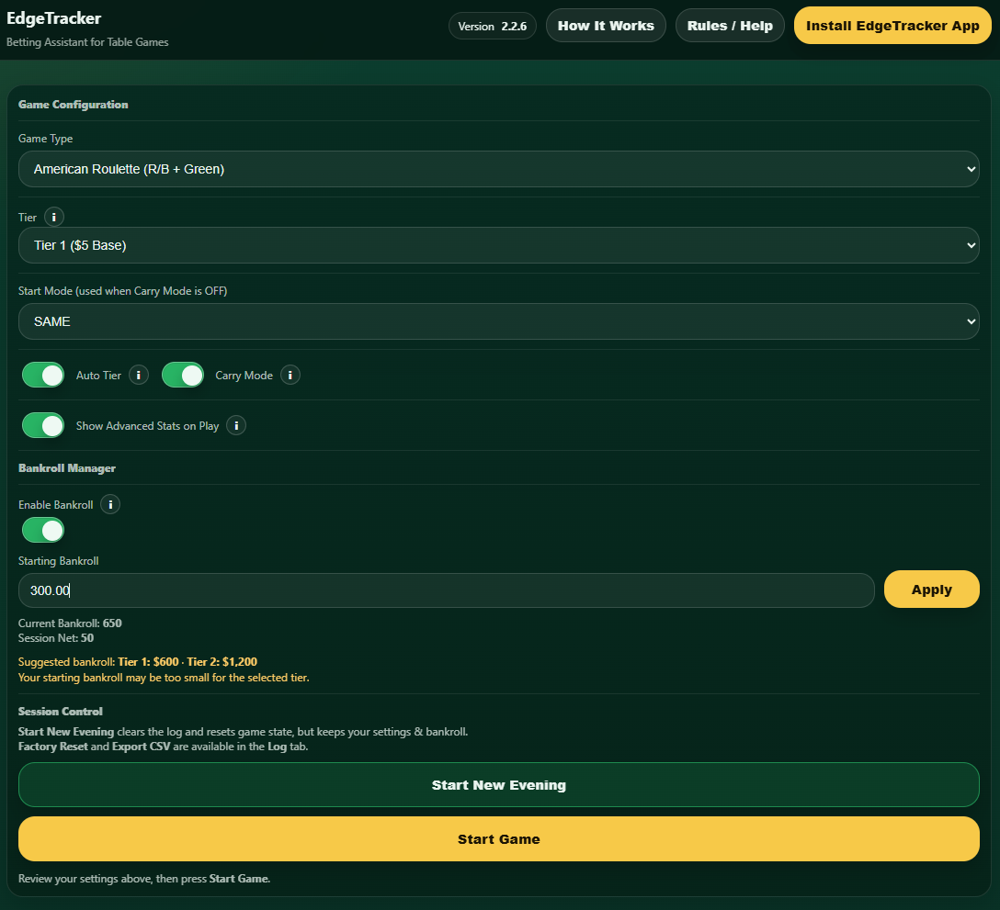
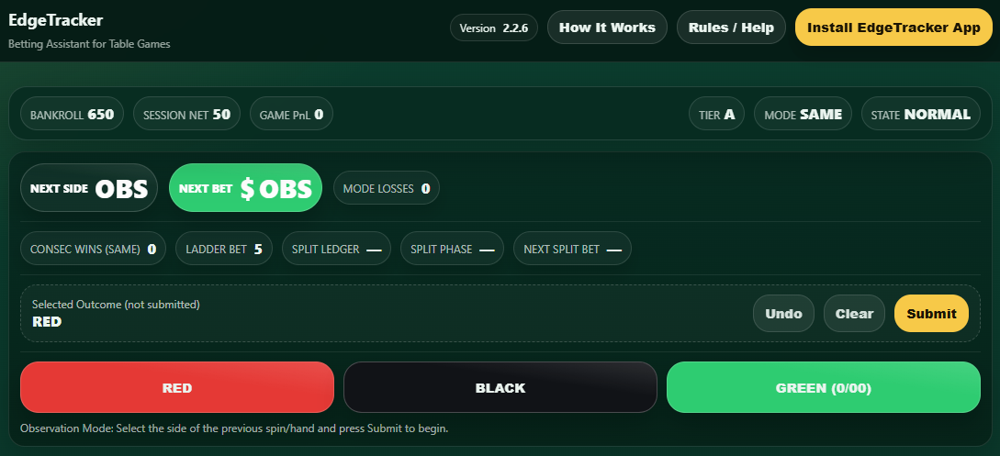
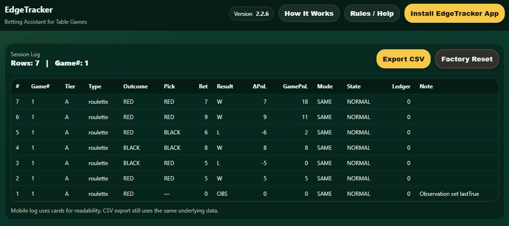

# EdgeTracker

EdgeTracker is a betting assistant that uses an adaptive phase progression engine to help organize structured betting sessions for even-money table games such as roulette and baccarat.

The application helps organize bet sizing, directional alignment, and session boundaries during live play while maintaining a consistent betting structure.

EdgeTracker does **not attempt to alter game outcomes** — it is a session management tool intended to help maintain consistency and discipline.

---

## Live Application

https://chachingcashmoney.github.io/

---

## App Preview

  
  
  

---

## Features

- Tier-based session structure
- Adaptive phase progression engine
- Observation-based game entry
- Automatic directional mode management
- Built-in bankroll manager
- Detailed session logging
- CSV export for spreadsheet analysis
- Mobile-optimized interface
- Installable PWA (runs like a native app)
- Offline support via service worker caching

---

## Supported Games

### Roulette
- Red / Black betting
- Green results treated as neutral outcomes

### Baccarat
- Player / Banker betting
- Tie results treated as neutral outcomes

---

## Installation

EdgeTracker can be installed directly from your browser as a Progressive Web App.

1. Open the live app: https://chachingcashmoney.github.io/
2. Tap **Install EdgeTracker App** or use your browser’s install option.

The app will then behave like a native application on your device.

---

## CSV Export

Session logs can be exported as CSV files for spreadsheet analysis.

Exports include:

- Game number
- Tier
- Game type
- Outcome
- Bet size
- Result
- Game PnL
- Session PnL
- Phase state information

Each export includes a **totals row** summarizing the session result.

---

## Responsible Use

EdgeTracker is a **session management framework only**.

Casino games retain inherent house advantage and outcomes are random.  
This application does **not modify game odds or influence results**.

Use responsibly and only where gambling is legally permitted.

---

## Deployment

This project is deployed using **GitHub Pages**.

Live site:

https://chachingcashmoney.github.io/

---

## Versioning

Application versions and release notes are maintained directly inside: app.js

---

## License

This project is provided for **educational and personal use**.
